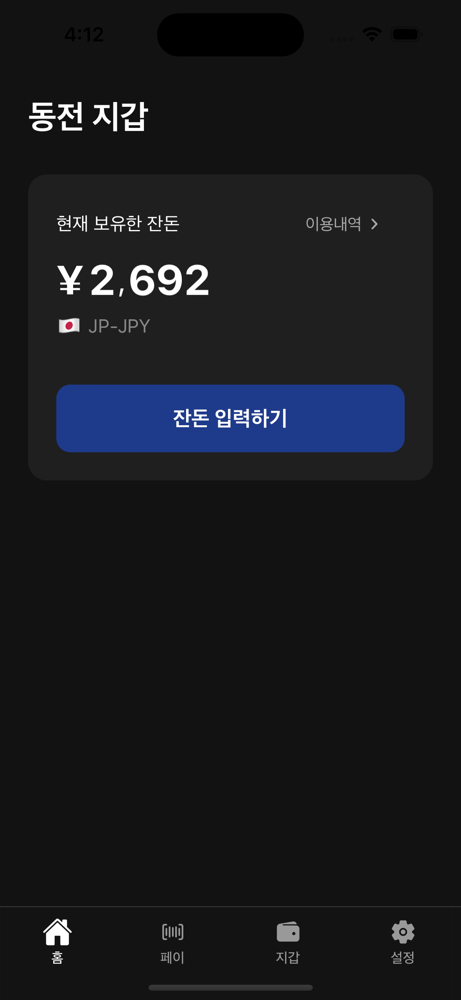
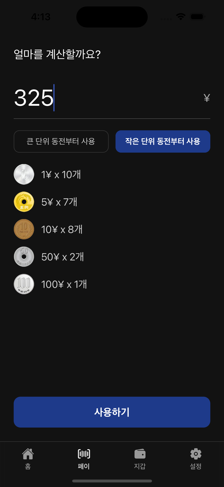
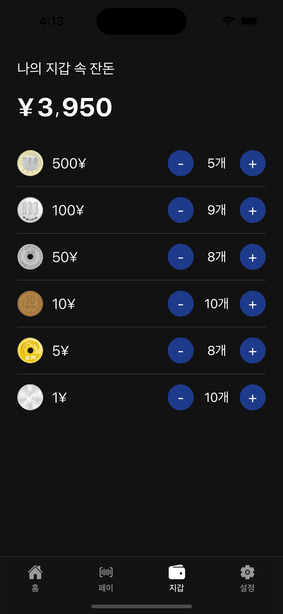
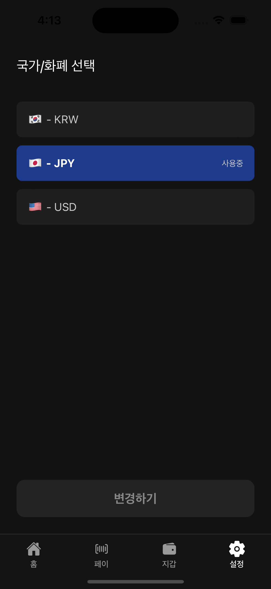
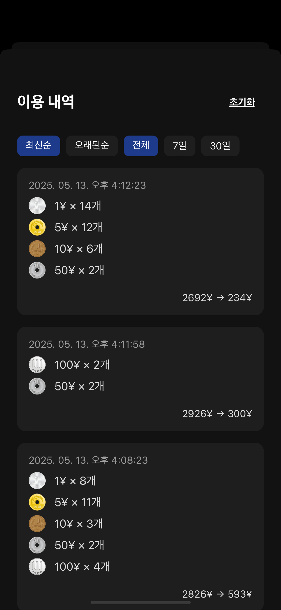

# 동전지갑 — 여행 동전지갑 App

일본여행을 계획하던 중 일본여행 필수 준비물이 동전지갑이라는 것을 알게됨. 동전 사용 비율이 높은 국가를 여행 후 많이 남는 자투리 동전을 여행중 효과적으로 활용하고자 기획

> “국가를 여행을 마칠 때 마다 남는 한 줌의 동전들, 이제는 모으지말고 먼저 쓰자!”

---

## 기능

- 🔢 **동전 계산기**  
  입력한 금액에 대해 두 가지 전략으로 최적 동전 조합을 제안
  - 큰 단위 우선
  - 작은 단위 우선

- 🌍 **다국적 통화 지원**  
  일본, 미국 등 국가 선택에 따라 동전 체계 자동 적용 가능 (`KR`, `JP`, `US`)

- 🧾 **사용내역 자동 기록**  
  사용된 동전 조합을 날짜별로 저장 및 내역 화면 제공

---

## 📸 Screenshots

<table>
  <tr>
    <td><b>Home</b></td>
    <td><b>Pay</b></td>
    <td><b>Purse</b></td>
    <td><b>Settings</b></td>
    <td><b>History Modal</b></td>
  </tr>
  <tr>
    <td></td>
    <td></td>
    <td></td>
    <td></td>
    <td></td>
  </tr>
</table>

---

## ⚒️ Stack

| Tech | Purpose |
|------|---------|
| `React Native` | Cross-platform app |
| `Expo Router` | File-based navigation |
| `MMKV` | Blazing fast local storage |
| `Zustand` | State management |
| `Reanimated` | High-performance animations |
| `expo-image` | Fast, efficient image handling |

---

## 최적의 동전 조합 전략 예시

```ts
// calculateBestCoinCombo(amount, coins, strategy)
calculateBestCoinCombo(270, [{ denomination: 100, quantity: 3 }, { denomination: 50, quantity: 2 }], "max-first")

// → [100x2, 50x1, 20x1]
```

---

## 📦 폴더 구조

```
📦app
 ┣ 📂(modals)
 ┃ ┗ 📜history-modal.tsx
 ┣ 📂(tabs)
 ┃ ┣ 📜_layout.tsx
 ┃ ┣ 📜calculator-screen.tsx
 ┃ ┣ 📜index.tsx
 ┃ ┣ 📜settings-screen.tsx
 ┃ ┗ 📜wallet-screen.tsx
 ┣ 📜+not-found.tsx
 ┗ 📜_layout.tsx
📦components
 ┣ 📂ui
 ┃ ┣ 📜IconSymbol.ios.tsx
 ┃ ┣ 📜IconSymbol.tsx
 ┃ ┗ 📜confirm-modal.tsx
 ┣ 📜haptic-tab.tsx
 ┣ 📜layout-with-tab-padding.tsx
 ┣ 📜rolling-number.tsx
 ┗ 📜splash-screen.tsx
📦constants
 ┣ 📜colors.ts
 ┗ 📜currencies.ts
📦stores
 ┣ 📂__test__
 ┃ ┗ 📜wallet-store.test.ts
 ┗ 📜wallet-store.ts
```


## 📲 시작하기

```bash
# 1. Install dependencies
npm install

# 2. Run the app
npx expo start

# (Optional)
npx expo run:ios
npx expo run:android
```

---

## 🚀 추가 기능 개발
 - Backup / Export history

 - Cloud sync (optional)

 - Visual charts per usage

 - OCR for scanning physical coins?

---

## 👨‍💻 Developed by
Taewoo Kwak

## 📄 License
MIT License © 2025


